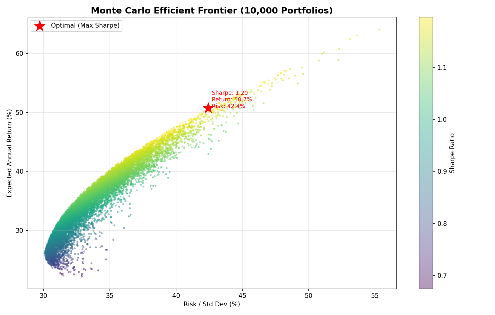
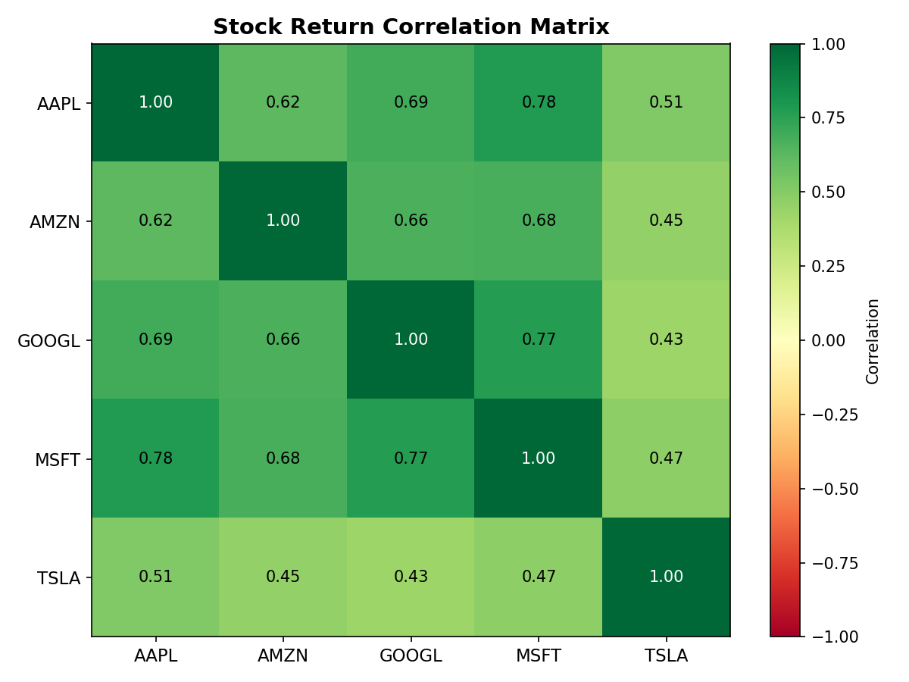
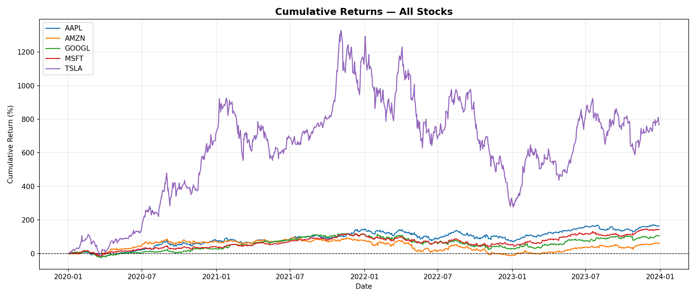
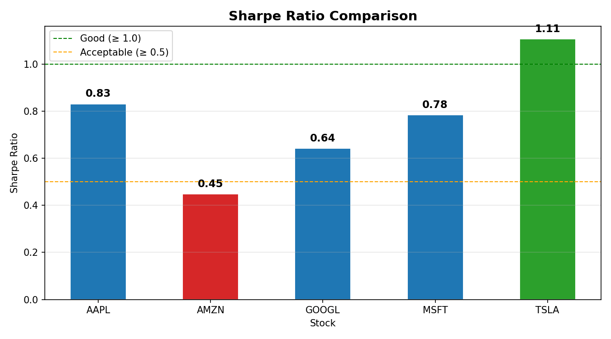
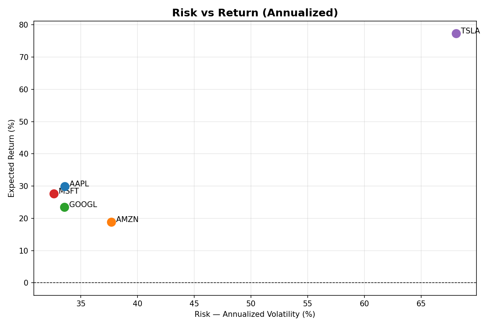
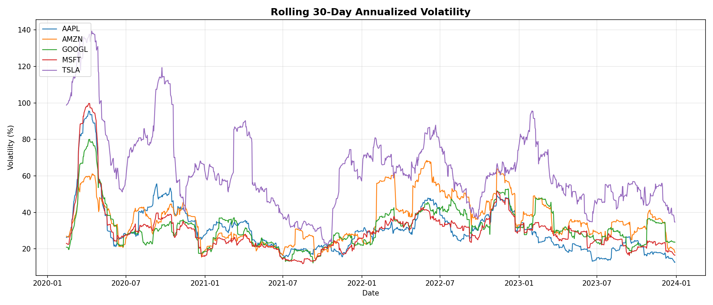
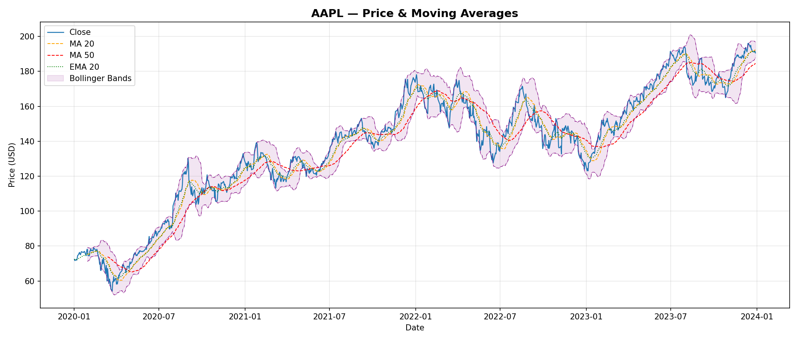
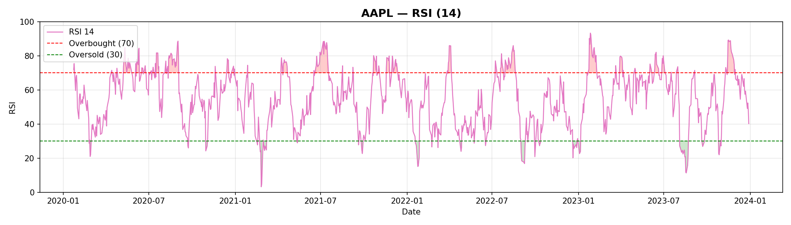
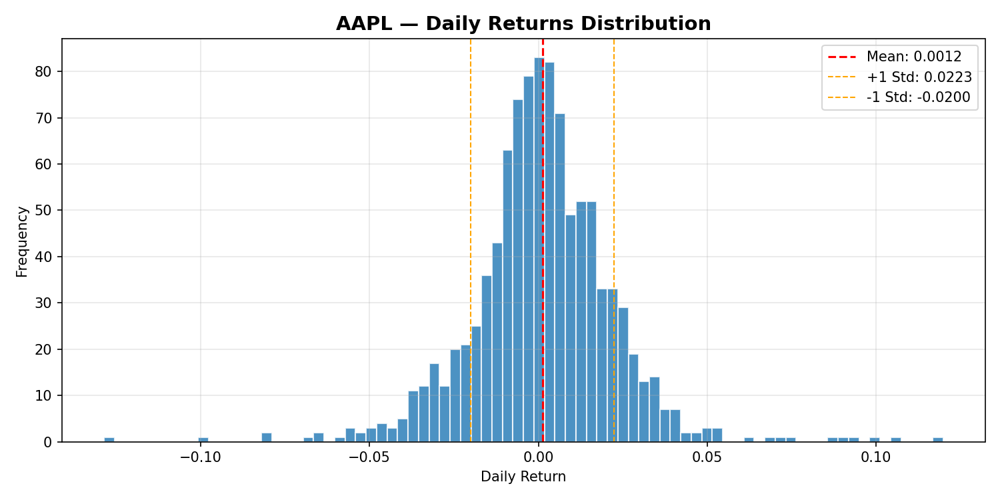
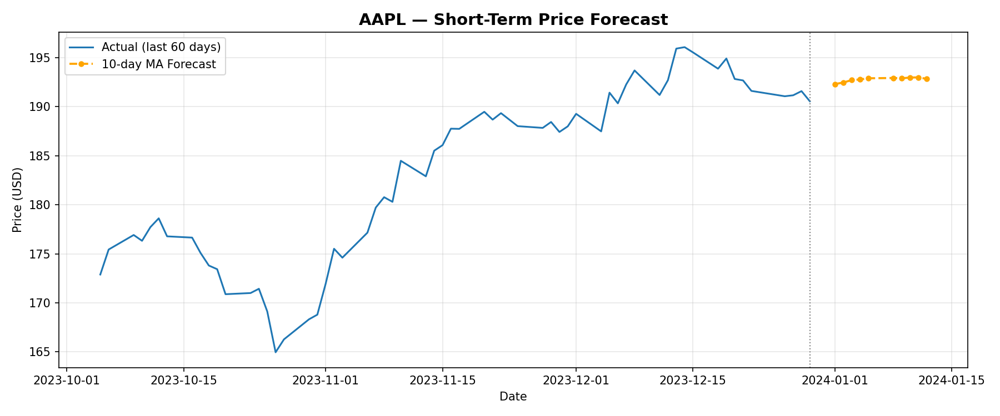

# 📈 Predictive Financial Analytics Dashboard

> A professional-grade stock market analytics system built entirely with **Python, Pandas & NumPy** — no ML libraries, no shortcuts. Features real-time feature engineering, manual predictive modeling, portfolio optimization via Monte Carlo simulation, and 10 auto-generated financial visualizations.

<br>


---

## 🗂️ Table of Contents

- [Overview](#-overview)
- [Features](#-features)
- [Project Structure](#-project-structure)
- [Setup & Installation](#-setup--installation)
- [How to Run](#-how-to-run)
- [Sample Output](#-sample-output)
- [Visualizations](#-visualizations)
- [Tech Stack](#-tech-stack)
- [Key Results](#-key-results)

---

## 🔍 Overview

This project demonstrates mastery of **data wrangling, numerical computation, and statistical analysis** applied to real-world financial data. It pulls historical OHLCV data for 5 major stocks (AAPL, MSFT, GOOGL, AMZN, TSLA) and runs a full analytics pipeline:

```
Raw CSV Data  →  Cleaning  →  Feature Engineering  →  Prediction  →  Portfolio Optimization  →  Visualizations
```

Everything from RSI calculation to linear regression to the efficient frontier is implemented **from scratch** using only Pandas and NumPy arrays.

---

## ✨ Features

### 📥 1. Data Acquisition & Cleaning
- Loads multiple CSVs of historical OHLCV stock data
- Handles missing values with forward fill, backward fill, and linear interpolation
- Normalizes and standardizes data using NumPy (Min-Max & Z-score)
- Aligns all stocks to a common date index automatically

### ⚙️ 2. Feature Engineering
- Simple & Exponential Moving Averages (MA20, MA50, EMA20)
- Daily returns, cumulative returns, annualized volatility
- **Bollinger Bands** — dynamic support/resistance levels
- **RSI (Relative Strength Index)** — momentum oscillator
- **Sharpe Ratio** — risk-adjusted return metric
- Momentum indicators

### 📊 3. Time-Series Analysis
- Rolling statistics: mean, std, skewness, kurtosis
- Full **correlation matrix** across all stocks
- Trend detection using MA crossover signals
- Autocorrelation analysis with pure NumPy

### 🔮 4. Predictive Modeling (No ML Libraries)
- **Linear Regression** implemented manually using NumPy OLS formula: `β = (X'X)⁻¹ X'y`
- **Moving Average Forecast** for short-term price prediction
- Model evaluation: MSE, RMSE, MAE — all computed with NumPy

### 💼 5. Portfolio Optimization
- **Monte Carlo simulation** — 10,000 random portfolio scenarios
- Mean-variance optimization using NumPy covariance matrices
- Identifies the **optimal portfolio** (maximum Sharpe Ratio)
- Identifies the **minimum variance portfolio**

### 📉 6. Visualizations (10 Charts)
- Price charts with Bollinger Bands & moving averages
- RSI with overbought/oversold zones
- Daily returns distribution histograms
- Cumulative returns comparison
- Rolling volatility over time
- Correlation heatmap
- Efficient frontier scatter plot
- Sharpe ratio bar chart
- Risk vs Return scatter
- Short-term price forecasts

---

## 📁 Project Structure

```
financial_dashboard/
│
├── 📂 data/                      # Raw stock CSV files
│   ├── AAPL.csv
│   ├── MSFT.csv
│   ├── GOOGL.csv
│   ├── AMZN.csv
│   └── TSLA.csv
│
├── 📂 output/                    # All generated results
│   ├── 📂 plots/                 # 10 generated PNG charts
│   ├── correlation_matrix.csv
│   ├── monte_carlo_results.csv
│   └── {TICKER}_features.csv
│
├── 📄 data_loader.py             # Module 1: Data loading & cleaning
├── 📄 features.py                # Module 2: Feature engineering
├── 📄 time_series.py             # Module 3: Time-series analysis
├── 📄 predictor.py               # Module 4: Predictive modeling
├── 📄 portfolio.py               # Module 5: Portfolio optimization
├── 📄 visualizer.py              # Module 6: All visualizations
├── 📄 main.py                    # Pipeline entry point
├── 📄 download_data.py           # One-time data downloader
├── 📄 requirements.txt
└── 📄 .gitignore
```

---

## ⚙️ Setup & Installation

### Prerequisites
- Python 3.10+
- Git

### 1. Clone the repository
```bash
git clone https://github.com/YOUR_USERNAME/financial_dashboard.git
cd financial_dashboard
```

### 2. Create & activate virtual environment
```bash
# Windows
python -m venv virtualEnviroment
virtualEnviroment\Scripts\activate

# macOS / Linux
python -m venv virtualEnviroment
source virtualEnviroment/bin/activate
```

### 3. Install dependencies
```bash
pip install -r requirements.txt
```

### 4. Download stock data (one-time)
```bash
python download_data.py
```

---

## ▶️ How to Run

```bash
python main.py
```

### Expected terminal output:
```
=======================================================
  STEP 1: Loading & Cleaning Data
=======================================================
  Loaded AAPL:  1006 rows | columns: ['Close', 'High', 'Low', 'Open', 'Volume']
  Loaded AMZN:  1006 rows | columns: ['Close', 'High', 'Low', 'Open', 'Volume']
  Loaded GOOGL: 1006 rows | columns: ['Close', 'High', 'Low', 'Open', 'Volume']
  Loaded MSFT:  1006 rows | columns: ['Close', 'High', 'Low', 'Open', 'Volume']
  Loaded TSLA:  1006 rows | columns: ['Close', 'High', 'Low', 'Open', 'Volume']

=======================================================
  STEP 2: Engineering Features
=======================================================
  AAPL  Sharpe Ratio: 0.8312
  AMZN  Sharpe Ratio: 0.4483
  GOOGL Sharpe Ratio: 0.6419
  MSFT  Sharpe Ratio: 0.7844
  TSLA  Sharpe Ratio: 1.1065

=======================================================
  STEP 3: Time-Series & Correlation Analysis
=======================================================
Correlation Matrix:
        AAPL   AMZN  GOOGL   MSFT   TSLA
AAPL   1.000  0.624  0.691  0.777  0.511
AMZN   0.624  1.000  0.664  0.679  0.454
GOOGL  0.691  0.664  1.000  0.773  0.428
MSFT   0.777  0.679  0.773  1.000  0.472
TSLA   0.511  0.454  0.428  0.472  1.000

=======================================================
  STEP 5: Portfolio Optimization (Monte Carlo)
=======================================================
  Optimal Portfolio (Max Sharpe Ratio):
    Expected Return : 50.31%
    Risk (Std Dev)  : 42.06%
    Sharpe Ratio    : 1.1962
    Weights:
      AAPL:  21.61%
      AMZN:   0.85%
      GOOGL:  1.64%
      MSFT:  30.96%
      TSLA:  44.94%
```

---

## 📊 Sample Output

### Terminal Results Summary

| Stock | Sharpe Ratio | Interpretation |
|-------|-------------|----------------|
| TSLA  | 1.1065 | ✅ Excellent risk-adjusted return |
| AAPL  | 0.8312 | ✅ Good |
| MSFT  | 0.7844 | ✅ Good |
| GOOGL | 0.6419 | 🟡 Acceptable |
| AMZN  | 0.4483 | 🟡 Below average |

### Optimal Portfolio Allocation

| Stock | Weight |
|-------|--------|
| TSLA  | 44.94% |
| MSFT  | 30.96% |
| AAPL  | 21.61% |
| GOOGL |  1.64% |
| AMZN  |  0.85% |

---

## 🖼️ Visualizations

> All charts are auto-generated and saved to `output/plots/` when you run `main.py`.

### 📌 Efficient Frontier — Monte Carlo Portfolio Optimization
*10,000 randomly simulated portfolios coloured by Sharpe Ratio. The red star marks the optimal portfolio.*



---

### 📌 Correlation Heatmap
*Pearson correlation between daily returns of all 5 stocks. AAPL–MSFT are most correlated (0.77).*



---

### 📌 Cumulative Returns — All Stocks (2020–2024)
*TSLA dramatically outperformed all others despite extreme volatility.*



---

### 📌 Sharpe Ratio Comparison
*Risk-adjusted performance across all 5 stocks. TSLA leads at 1.10.*



---

### 📌 Risk vs Return
*Annualized return plotted against annualized volatility per stock.*



---

### 📌 Rolling Volatility
*30-day annualized rolling volatility — TSLA shows significantly higher risk.*



---

### 📌 AAPL — Price & Moving Averages with Bollinger Bands


---

### 📌 AAPL — RSI (14-period)
*Highlights overbought (>70) and oversold (<30) zones.*



---

### 📌 AAPL — Daily Returns Distribution


---

### 📌 AAPL — 10-Day Price Forecast
*Short-term forecast using Moving Average model built with pure NumPy.*



---

## 🛠️ Tech Stack

| Tool | Purpose |
|------|---------|
| **Python 3.10+** | Core language |
| **Pandas** | Data loading, cleaning, time-series operations |
| **NumPy** | All numerical computation, OLS regression, Monte Carlo |
| **Matplotlib** | All chart generation |
| **yfinance** | One-time historical data download only |

> ⚠️ No scikit-learn, no statsmodels, no ML frameworks — everything is implemented from scratch.

---

## 📐 Key Algorithms Implemented from Scratch

```python
# OLS Linear Regression — pure NumPy
β = (X'X)⁻¹ X'y
beta = np.linalg.pinv(X.T @ X) @ X.T @ y

# Sharpe Ratio
sharpe = (mean_excess_return / std_excess_return) * sqrt(252)

# Portfolio Variance
variance = weights @ covariance_matrix @ weights.T

# RSI
RS = avg_gain / avg_loss
RSI = 100 - (100 / (1 + RS))

# Bollinger Bands
upper = MA(20) + 2 * rolling_std(20)
lower = MA(20) - 2 * rolling_std(20)
```

---

## 📜 License

This project is licensed under the MIT License — feel free to use, modify, and distribute.

---

## 🙋 Author

Built by **[Your Name]**
🔗 [LinkedIn](https://linkedin.com/in/yourprofile) • [GitHub](https://github.com/yourusername)

---

> ⭐ If you found this useful, give it a star on GitHub!
